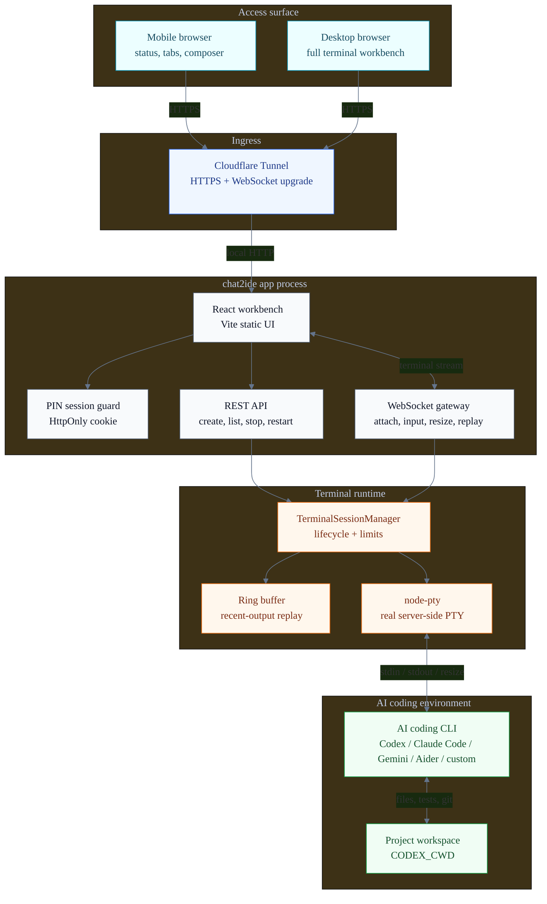
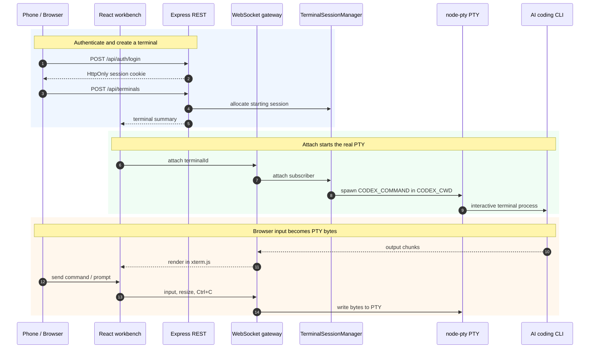

# chat2ide

`chat2ide` is a self-hosted remote terminal for one user's Codex CLI sessions. It starts real PTY processes on your server and exposes terminal output, input, reconnect, and recent-output replay through a browser UI.

It is built for a narrow use case: you already have Codex CLI working on a trusted Linux dev box, VPS, or home server, and you want to check or steer those jobs from a laptop, tablet, or phone.

## Preview

<p align="center">
  
</p>

The mobile view is not a shrunken desktop terminal. It keeps the workspace status, terminal tabs, real xterm output, and a bottom command composer in one screen for long-running AI coding jobs.

## What This Repository Does

- Provides a PIN-protected private web console.
- Creates multiple independent Codex CLI terminal tabs.
- Uses `xterm.js` to render real terminal output, including ANSI sequences and cursor control.
- Lets mobile users send commands from a bottom input bar instead of typing directly into xterm.
- Shows terminal totals, running/starting/stopped/error counts, unread background output, and the active terminal size.
- Keeps the last 30 sent commands in browser memory for the current session, with arrow-key recall for single-line input. The history is not written to local storage.
- Reconnects after refresh or short network drops and replays recent terminal output.
- Moves to the adjacent terminal after closing the active tab, which keeps multi-task switching predictable.
- Works behind Cloudflare Tunnel so the app can stay bound to `127.0.0.1`.
- Limits terminal count, single input size, and WebSocket message size.
- Uses no database. Sessions, PTY processes, and replay buffers live in server memory.

## Stack and AI Coding CLI Integration

| Layer | Technology | Role |
| --- | --- | --- |
| Browser workbench | React, Vite, Tailwind CSS, xterm.js | Renders the mobile/desktop console, terminal tabs, and real ANSI terminal output |
| Server | Express, `ws`, TypeScript | Serves auth, terminal APIs, and the `/ws` WebSocket channel |
| Terminal runtime | `node-pty` | Starts real server-side PTYs so interactive CLIs behave like they are in a normal terminal |
| Remote access | Cloudflare Tunnel | Forwards a public HTTPS hostname to the local `127.0.0.1:3000` service |
| State | Process memory and ring buffers | Keeps login sessions, PTY process handles, and recent-output replay |

The default command is `codex`. To use Claude Code, Gemini CLI, Aider, or a custom AI coding wrapper, point `CODEX_COMMAND` at that command and configure `CODEX_ARGS` as needed. `chat2ide` does not call those tools through private APIs; it moves terminal bytes between the browser, WebSocket, PTY, and CLI process.

## What It Is Not

- A multi-user IDE.
- An enterprise audit terminal.
- A command sandbox.
- A file permission or project ACL system.
- A persistent terminal history system.
- A console that automatically redacts terminal output.

After login, the user can run commands as the OS account that runs `chat2ide`. Run it with a low-privilege account and point `CODEX_CWD` at a specific project directory.

## Communication Architecture



## Runtime Flow



When a terminal is created, the server stores a `starting` session first. The PTY starts only after the browser attaches over WebSocket, so startup prompts go into the real xterm view.

## Requirements

- Node.js 20.19+ and npm.
- A Linux machine that can keep the service running.
- Codex CLI installed and authenticated on that machine, or `CODEX_COMMAND` pointing at another command.
- A project directory for `CODEX_CWD`.
- For public access, Cloudflare Tunnel and your own domain are recommended.

Windows is fine for local development and smoke tests. Linux is still the recommended production target because `node-pty` and interactive CLIs behave more predictably there.

## Local Development

```bash
npm install
cp env.example .env
npm run dev
```

Windows PowerShell:

```powershell
npm install
Copy-Item env.example .env
npm run dev
```

Development mode starts:

- API/WebSocket: `http://127.0.0.1:3000`
- Vite frontend: `http://127.0.0.1:5173`

## Production Build

```bash
npm install
npm run test
npm run build
npm run start
```

Linux helper scripts:

```bash
./scripts/bootstrap.sh
./scripts/test.sh
./scripts/dev.sh start
```

## Minimal Configuration

Copy `env.example` to `.env` and check at least these values:

```dotenv
APP_HOST=127.0.0.1
APP_PORT=3000
APP_PUBLIC_ORIGIN=https://terminal.example.com
APP_TRUST_PROXY=1
APP_PIN_HASH=scrypt$<salt-hex>$<hash-hex>
CODEX_COMMAND=codex
CODEX_CWD=/srv/your-project
TERMINAL_MAX_SESSIONS=8
TERMINAL_MAX_INPUT_BYTES=65536
APP_WS_MAX_MESSAGE_BYTES=131072
```

For local development, a plain PIN is acceptable:

```dotenv
APP_PIN=123456
```

Use `APP_PIN_HASH` in production:

```bash
node -e 'const c=require("crypto");const pin=process.argv[1];const salt=c.randomBytes(16);const hash=c.scryptSync(pin,salt,32);console.log(`scrypt$${salt.toString("hex")}$${hash.toString("hex")}`)' 123456
```

Before deployment, run:

```bash
npm run preflight
```

It checks Node, `node-pty`, PIN configuration, `CODEX_CWD`, `CODEX_ARGS`, `CODEX_COMMAND`, PTY runtime, `APP_PUBLIC_ORIGIN`, PIN hash format, and resource limits. The default PIN and a missing public origin are reported as warnings.

## Cloudflare Tunnel

The recommended topology is `cloudflared` on the server forwarding a public HTTPS hostname to `http://127.0.0.1:3000`.

```yaml
tunnel: chat2ide
credentials-file: /etc/cloudflared/chat2ide.json

ingress:
  - hostname: terminal.example.com
    service: http://127.0.0.1:3000
  - service: http_status:404
```

HTTP API and WebSocket use the same origin. The WebSocket path is `/ws`. See [Cloudflare deployment](docs/deploy-cloudflare.md) for the full flow.

## Daily Use

1. Open the deployed URL.
2. Enter the configured PIN.
3. Click "New terminal".
4. Send commands or prompts from the bottom input bar.
5. Switch tasks with terminal tabs.
6. Use `Ctrl+C` to interrupt, "Stop" to end the process, "Restart" to clear the view and start a new PTY, and "Close" to remove the tab.
7. After refresh or a short disconnect, the page reattaches to the current terminal and replays recent output.

On phones, use the bottom input bar first. Terminal tabs scroll horizontally; the top overview shows whether background terminals have unread output, errors, or sessions still starting.

## Mobile Check

Use a narrow viewport such as 390 x 844:

```bash
npm run build
APP_PIN=123456 CODEX_COMMAND=/bin/bash CODEX_ARGS='["-i"]' CODEX_CWD=$PWD npm run start
```

Windows PowerShell:

```powershell
npm run build
$env:APP_PIN="123456"; $env:CODEX_COMMAND="powershell.exe"; $env:CODEX_ARGS='["-NoLogo"]'; $env:CODEX_CWD=$PWD; npm run start
```

Open `http://127.0.0.1:3000`, check that the page has no horizontal scrolling, that the overview does not crowd out the terminal, that the terminal and bottom input are visible, and send one command to confirm output appears. Send a second command and use the arrow keys in single-line input to confirm the in-memory command history recalls it.

## Operational Boundaries

- `/api/health` is available for basic health checks.
- Restarting the service clears login sessions, PTY processes, and ring buffers.
- The ring buffer stores recent output only. It is not a full log.
- `TERMINAL_MAX_SESSIONS`, `TERMINAL_MAX_INPUT_BYTES`, and `APP_WS_MAX_MESSAGE_BYTES` are misuse guardrails, not a sandbox.

## Documentation

- [Product and scope](docs/product.md)
- [Configuration](docs/configuration.md)
- [User guide](docs/user-guide.md)
- [Architecture](docs/architecture.md)
- [Protocol](docs/protocol.md)
- [Security boundary](docs/security.md)
- [Cloudflare deployment](docs/deploy-cloudflare.md)
- [Development guide](docs/dev-guide.md)
- [Operations](docs/operations.md)
- [Manual test plan](docs/manual-test-plan.md)
- [Troubleshooting](docs/troubleshooting.md)
- [Contributing](CONTRIBUTING.md)
- [Security policy](SECURITY.md)
