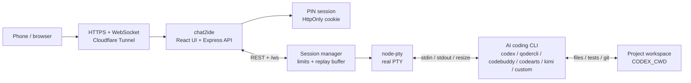
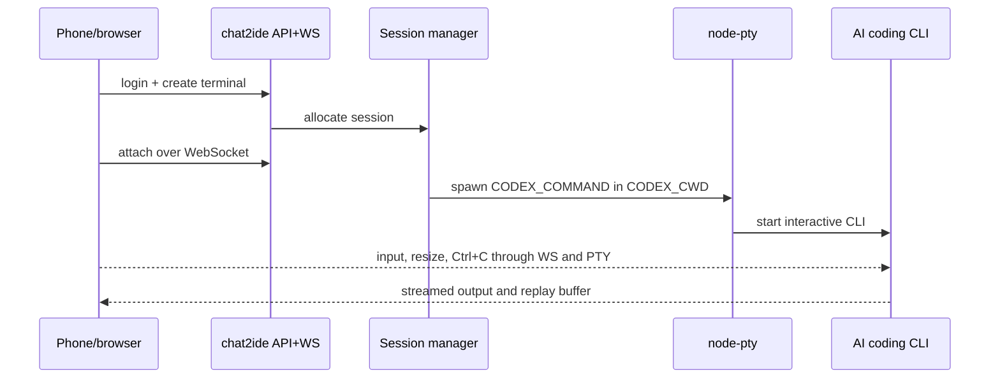

# chat2ide

`chat2ide` is a self-hosted mobile remote terminal for AI coding tools. It starts real PTY processes on your server for Codex CLI, Qoder, Claude Code, Cursor Agent, Qwen Code, CodeBuddy, Kimi Code, Aider, and other terminal agents, and it also supports a direct client bridge for IDE plugins or desktop clients that do not expose an independently runnable CLI.

It is built for a narrow use case: you already have an AI coding CLI working on a trusted Linux dev box, VPS, or home server, and you want to check or steer those jobs from a laptop, tablet, or phone.

It is not remote desktop and it is not an online IDE. The core is React, xterm.js, WebSocket, and `node-pty`: a private web console for real PTY sessions with reconnect and recent-output replay.

## Preview

<p align="center">
  
</p>

The mobile view is not a shrunken desktop terminal. It keeps the workspace status, terminal tabs, real xterm output, and a bottom command composer in one screen for long-running AI coding jobs.

## Current Status

Completed and verified:

- Server-side PTY terminals still work, including multiple profiles, cwd allowlists, input-size limits, output ring-buffer replay, stop, restart, and close.
- The direct client bridge is implemented. Trusted IDE/plugin/desktop companions without standalone CLIs can connect to `/bridge`, publish their own sessions, and receive browser-forwarded `input`, `resize`, `stop`, `restart`, and `close` control messages.
- The browser now shows PTY and Bridge sessions through the same terminal tab workflow. Bridge sessions display backend, client name, status, recent output, and bridge-specific controls.
- Configuration, protocol docs, security notes, user guide, manual test plan, and smoke scripts are updated.
- Current local verification passed: `npm test`, `npm run smoke:e2e`, `npm run build`, `npm run preflight` with `APP_PIN` / `APP_BRIDGE_TOKEN`, plus a Playwright browser login and Bridge input echo check.

Not done or intentionally out of scope:

- `chat2ide` does not remote-control Cursor, Windsurf, Trae, Lingma, Comate, CodeGeeX, or other GUI/plugin surfaces. Those clients can only appear in `chat2ide` after they implement a companion that publishes sessions through `/bridge`.
- The repository currently provides the Bridge protocol and a smoke client, not ready-made companion SDKs for vendor IDE plugins.
- Multi-user collaboration, enterprise audit, command sandboxing, fine-grained Linux permission isolation, and persistent full terminal history are not included.
- Platform profile presets, push notifications, and more vendor-specific smoke scripts remain follow-up enhancements.

## Search Fit

This repository is meant for people looking for:

- Mobile control for Codex CLI, Qoder, Claude Code, Cursor Agent, Qwen Code, and other AI coding CLI jobs.
- A self-hosted private web terminal for a Linux dev box, VPS, or home server, without remote desktop.
- A reconnectable mobile terminal built with Cloudflare Tunnel, WebSocket, `node-pty`, and `xterm.js`.
- A way to view, type into, interrupt with `Ctrl+C`, and restart terminal agents from a phone.

## What This Repository Does

- Provides a PIN-protected private web console.
- Creates multiple independent Codex CLI terminal tabs.
- Uses `xterm.js` to render real terminal output, including ANSI sequences and cursor control.
- Lets mobile users send commands from a bottom input bar instead of typing directly into xterm.
- Shows terminal totals, running/starting/stopped/error counts, unread background output, and the active terminal size.
- Keeps the last 30 sent commands in browser memory for the current session, with arrow-key recall for single-line input. The history is not written to local storage.
- Reconnects after refresh or short network drops and replays recent terminal output.
- Moves to the adjacent terminal after closing the active tab, which keeps multi-task switching predictable.
- Works behind Cloudflare Tunnel so the app can stay bound to `127.0.0.1`.
- Limits terminal count, single input size, and WebSocket message size.
- Uses no database. Sessions, PTY processes, and replay buffers live in server memory.

## Stack and AI Coding CLI Integration

| Layer | Technology | Role |
| --- | --- | --- |
| Browser workbench | React, Vite, Tailwind CSS, xterm.js | Renders the mobile/desktop console, terminal tabs, and real ANSI terminal output |
| Server | Express, `ws`, TypeScript | Serves auth, terminal APIs, and the `/ws` WebSocket channel |
| Terminal runtime | `node-pty` | Starts real server-side PTYs so interactive CLIs behave like they are in a normal terminal |
| Remote access | Cloudflare Tunnel | Forwards a public HTTPS hostname to the local `127.0.0.1:3000` service |
| State | Process memory and ring buffers | Keeps login sessions, PTY process handles, and recent-output replay |

The default command is `codex`. To use another AI coding tool, point `CODEX_COMMAND` at a real terminal command and configure `CODEX_ARGS` as needed. For multiple CLI entrypoints, use `TERMINAL_PROFILES`. If a product has no standalone CLI, write a trusted IDE/plugin/desktop companion that connects to `/bridge` with `APP_BRIDGE_TOKEN` or an `APP_BRIDGE_CLIENTS` scoped token, publishes its own sessions, and receives mobile input/resize/control messages.

## AI Coding Platform Support

`chat2ide` directly supports terminal-native AI coding agents: the tool must run inside a server shell, accept stdin in a PTY, and write terminal output to stdout/stderr. GUI editors can share the same host and project directory, but `chat2ide` does not remote-control editor windows, proprietary sidebars, browser workspaces, or vendor cloud sessions.

Before calling an integration ready on a new host, verify four things: the command exists, vendor auth works under the same OS account, the CLI starts from `CODEX_CWD` in a normal terminal, and `chat2ide` can create a terminal with that `CODEX_COMMAND`.

| Platform | Direct target? | `CODEX_COMMAND` / args | Recommended setup | Reference docs |
| --- | --- | --- | --- | --- |
| OpenAI Codex CLI | Yes | `CODEX_COMMAND=codex` | Run `codex login`, then launch from the project directory. | [Codex CLI reference](https://developers.openai.com/codex/cli/reference) |
| Anthropic Claude Code | Yes | `CODEX_COMMAND=claude` | Run `claude auth login` or the account login flow on the server. | [Claude Code CLI reference](https://code.claude.com/docs/en/cli-reference) |
| Google Gemini CLI | Yes | `CODEX_COMMAND=gemini` | Install `@google/gemini-cli`, run `gemini`, and complete Google authentication. | [Gemini CLI installation](https://geminicli.com/docs/get-started/installation/) |
| Cursor Agent CLI | Yes | `CODEX_COMMAND=cursor-agent` | Install Cursor CLI and authenticate it. This controls the terminal agent, not the Cursor editor GUI. | [Cursor CLI docs](https://cursor.com/docs/cli/overview) |
| Qoder CLI | Yes | `CODEX_COMMAND=qodercli` | Install `@qoder-ai/qodercli`, run `qodercli`, then use `/login` or `QODER_PERSONAL_ACCESS_TOKEN`. If you refer to qCoder in this project, it means Qoder. | [Qoder CLI quick start](https://docs.qoder.com/en/cli/quick-start) |
| Trae Agent CLI | Yes | `CODEX_COMMAND=trae-cli`, `CODEX_ARGS=["interactive"]` | Use the open-source `trae-agent` CLI. For one-off tasks, run `trae-cli run "<task>"` inside a shell or wrapper. | [trae-agent README](https://github.com/bytedance/trae-agent/blob/main/README.md) |
| Qwen Code | Yes | `CODEX_COMMAND=qwen` | Install `@qwen-code/qwen-code`, run `qwen`, then configure `/auth`. | [Qwen Code](https://github.com/QwenLM/qwen-code) |
| Tencent CodeBuddy Code | Yes | `CODEX_COMMAND=codebuddy` | Install `@tencent-ai/codebuddy-code`, confirm `codebuddy --version`, then run `codebuddy` from the project directory to finish login and permission prompts. | [CodeBuddy Code installation](https://copilot.tencent.com/docs/cli/installation) |
| Tencent CloudBase AI CLI | Yes, as a unified entrypoint | `CODEX_COMMAND=tcb`, `CODEX_ARGS=["ai","-a","codebuddy"]` | Useful for CloudBase or Tencent Cloud projects. Sign in to CloudBase CLI first, then use `tcb ai` to choose CodeBuddy, Qwen Code, or another backend tool. | [CloudBase AI CLI](https://docs.cloudbase.net/cli-v1/ai/introduce) |
| Huawei CodeArts Agent / Madao CLI | Yes | `CODEX_COMMAND=codearts` | Install the Madao CLI, run `codearts` in the project directory, and finish browser authorization. Use `codearts run "<message>"` for one-off tasks. | [Quick start](https://support.huaweicloud.com/usermanual-cli/codeartsagent_cli_0002.html) / [Command reference](https://support.huaweicloud.com/usermanual-cli/codeartsagent_cli_0034.html) |
| Kimi Code CLI | Yes | `CODEX_COMMAND=kimi` | Install `@moonshot-ai/kimi-code` or the official installer, confirm `kimi --version`, then use `/login` on first launch. | [Kimi Code getting started](https://www.kimi.com/code/docs/en/kimi-code-cli/guides/getting-started.html) |
| Kiro CLI | Yes | `CODEX_COMMAND=kiro-cli`, `CODEX_ARGS=["chat"]` | Install Kiro CLI, complete browser authentication, then start chat from the project directory. | [Kiro CLI installation](https://kiro.dev/docs/cli/installation/) |
| GitHub Copilot CLI | Yes, if the standalone CLI is installed | `CODEX_COMMAND=copilot` | Install Copilot CLI, ensure organization policy allows it, and sign in. Use a wrapper if you only have `gh copilot`. | [GitHub Copilot CLI](https://docs.github.com/en/copilot/how-tos/copilot-cli/cli-getting-started) |
| Aider | Yes | `CODEX_COMMAND=aider` | Install `aider-chat`, configure model credentials, and start it in the repo. | [Aider installation](https://aider.chat/docs/install.html) |
| Goose CLI | Yes | `CODEX_COMMAND=goose`, `CODEX_ARGS=["session"]` | Install the CLI, configure an LLM provider, then run `goose session`. | [Goose installation](https://goose-docs.ai/docs/getting-started/installation/) |
| Windsurf / Devin Desktop | Indirect | `CODEX_COMMAND=bash` or `powershell` | Use Cascade and the enhanced terminal inside the IDE; use `chat2ide` beside it for mobile shell, tests, git, and other CLI agents. | [Terminal and Cascade docs](https://docs.devin.ai/desktop/terminal) |
| Trae IDE | Indirect unless using `trae-agent` | Use `trae-cli` for direct PTY control | `chat2ide` is not remote desktop and does not control IDE plugin state. | [trae-agent README](https://github.com/bytedance/trae-agent/blob/main/README.md) |

### CLI Works, IDEs And Apps Are Indirect

When a vendor ships a CLI, desktop IDE, browser workspace, plugin, and mobile app, `chat2ide` prefers the server-side CLI. IDE windows, plugin sidebars, vendor cloud workspaces, and mobile-app sessions are only exposed when a trusted companion explicitly publishes them through `/bridge`.

| Ecosystem / product | CLI path | IDE / app status |
| --- | --- | --- |
| Cursor | `cursor-agent` can be used directly | Cursor IDE GUI, sidebars, and editor state are not controlled |
| Windsurf / Devin Desktop | Use `bash` / `powershell` or another CLI agent beside it | Cascade, desktop windows, and IDE state are not controlled |
| Trae / MarsCode | `trae-cli` can be used directly | Trae IDE, MarsCode cloud workspaces, and plugin experiences are not controlled |
| Qoder | `qodercli` can be used directly | Qoder IDE / app surfaces are not controlled; use the CLI for terminal control |
| Qwen / Alibaba Lingma | `qwen` can be used directly | Lingma IDE, VS Code / JetBrains plugins, and Agent panels need a companion to use Bridge |
| Tencent CodeBuddy | `codebuddy` or `tcb ai -a codebuddy` can be used directly | CodeBuddy IDE, plugins, and WorkBuddy mini app are not controlled |
| Huawei CodeArts | `codearts` can be used directly | CodeArts Snap, IDE plugins, and console workspaces are not controlled |
| Kimi Code | `kimi` can be used directly | Kimi Code VS Code extension or app sessions are not controlled |
| Gemini / Claude / Copilot | `gemini`, `claude`, and `copilot` can be used directly | Gemini Code Assist, Claude / Copilot IDE plugins, and app sessions are not controlled |

### China-Market Platform Status

These tools are common in China-market development workflows, but not every product shape can be controlled by `chat2ide`. The rule is unchanged: direct support requires a public terminal CLI that runs inside a PTY.

| Platform | Current status | Notes | Reference |
| --- | --- | --- | --- |
| Alibaba Lingma IDE / plugins | Bridge companion / indirect | Public docs focus on Lingma IDE, VS Code / JetBrains plugins, and Agent Mode. No standalone terminal CLI is shown there as a `CODEX_COMMAND` target; a plugin companion can publish sessions through `/bridge`. Use Qoder or Qwen Code for Alibaba-family terminal workflows. | [Lingma IDE quick start](https://help.aliyun.com/zh/lingma/user-guide/lingma-ide-get-started) |
| Baidu Comate / Wenxin Kuaima | Bridge companion / indirect | Public docs describe Comate Agent inside the Comate plugin or Comate AI IDE. No standalone CLI is shown there as a direct `CODEX_COMMAND` target; a client-side companion can publish sessions through `/bridge`. | [Comate Agent overview](https://cloud.baidu.com/doc/COMATE/s/9mm5qvpb4) |
| MarsCode / Trae IDE | Indirect, CLI path is `trae-agent` | MarsCode / Trae IDE are IDE, cloud workspace, or plugin experiences. Use `trae-cli` when terminal control is required. | [MarsCode](https://www.marscode.com/home) |
| CodeGeeX | Bridge companion / indirect | The official product is centered on IDE plugins and enterprise editions. Public docs do not show an official terminal-native coding-agent CLI; a plugin companion can publish sessions through `/bridge`. | [CodeGeeX](https://www.codegeex.cn/) |
| CodeBuddy IDE / plugins | Indirect, CLI path is `codebuddy` | GUI and plugin state are not remote-controlled by `chat2ide`; use CodeBuddy Code CLI for direct PTY integration. | [CodeBuddy IDE introduction](https://copilot.tencent.com/docs/ide/Introduction) |
| CodeArts Snap / IDE plugins | Indirect, CLI path is `codearts` | IDE assistants and plugins are not remote-controlled by `chat2ide`; use CodeArts Agent / Madao CLI for direct PTY integration. | [CodeArts Agent CLI](https://support.huaweicloud.com/usermanual-cli/codeartsagent_cli_0001.html) |

Common configurations:

```dotenv
# Codex CLI
CODEX_COMMAND=codex
CODEX_ARGS=[]
CODEX_CWD=/srv/your-project
```

```dotenv
# Direct client bridge for products without a standalone CLI
APP_BRIDGE_TOKEN=bridge-token-32-bytes-minimum-dev-123456
# Prefer scoped tokens for multiple production companions
# APP_BRIDGE_CLIENTS=[{"id":"desktop-ide","name":"Desktop IDE","token":"replace-with-32-byte-random-client-token"}]
```

```bash
APP_BRIDGE_TOKEN=bridge-token-32-bytes-minimum-dev-123456 node scripts/bridge-smoke-client.mjs
npm run build && npm run smoke:e2e
```

```dotenv
# Cursor Agent CLI
CODEX_COMMAND=cursor-agent
CODEX_ARGS=[]
CODEX_CWD=/srv/your-project
```

```dotenv
# Claude Code
CODEX_COMMAND=claude
CODEX_ARGS=[]
CODEX_CWD=/srv/your-project
```

```dotenv
# Gemini CLI
CODEX_COMMAND=gemini
CODEX_ARGS=[]
CODEX_CWD=/srv/your-project
```

```dotenv
# Qoder CLI
CODEX_COMMAND=qodercli
CODEX_ARGS=[]
CODEX_CWD=/srv/your-project
```

```dotenv
# Trae Agent wrapper. scripts/run-trae-agent.sh can call trae-cli run or start a shell.
CODEX_COMMAND=/srv/chat2ide/scripts/run-trae-agent.sh
CODEX_ARGS=[]
CODEX_CWD=/srv/your-project
```

```dotenv
# Qwen Code
CODEX_COMMAND=qwen
CODEX_ARGS=[]
CODEX_CWD=/srv/your-project
```

```dotenv
# Tencent CodeBuddy Code
CODEX_COMMAND=codebuddy
CODEX_ARGS=[]
CODEX_CWD=/srv/your-project
```

```dotenv
# Tencent CloudBase AI CLI, using CodeBuddy Code
CODEX_COMMAND=tcb
CODEX_ARGS=["ai","-a","codebuddy"]
CODEX_CWD=/srv/your-project
```

```dotenv
# Huawei CodeArts Agent / Madao CLI
CODEX_COMMAND=codearts
CODEX_ARGS=[]
CODEX_CWD=/srv/your-project
```

```dotenv
# Kimi Code CLI
CODEX_COMMAND=kimi
CODEX_ARGS=[]
CODEX_CWD=/srv/your-project
```

```dotenv
# Kiro CLI chat
CODEX_COMMAND=kiro-cli
CODEX_ARGS=["chat"]
CODEX_CWD=/srv/your-project
```

```dotenv
# GitHub Copilot CLI
CODEX_COMMAND=copilot
CODEX_ARGS=[]
CODEX_CWD=/srv/your-project
```

```dotenv
# Aider
CODEX_COMMAND=aider
CODEX_ARGS=[]
CODEX_CWD=/srv/your-project
```

```dotenv
# Goose CLI
CODEX_COMMAND=goose
CODEX_ARGS=["session"]
CODEX_CWD=/srv/your-project
```

If a platform only exposes a desktop GUI, browser workspace, or IDE plugin and has no public terminal CLI, do not set it directly as `CODEX_COMMAND`. Use `/bridge` when you can build a trusted companion; otherwise use `bash`/`powershell` as the command and run tests, git, deployment scripts, or another real CLI agent from the mobile terminal.

## What It Is Not

- A multi-user IDE.
- An enterprise audit terminal.
- A command sandbox.
- A file permission or project ACL system.
- A persistent terminal history system.
- A console that automatically redacts terminal output.

After login, the user can run commands as the OS account that runs `chat2ide`. Run it with a low-privilege account and point `CODEX_CWD` at a specific project directory.

## Requirements

- Node.js 20.19+ and npm.
- A Linux machine that can keep the service running.
- Codex CLI installed and authenticated on that machine, or `CODEX_COMMAND` pointing at another command.
- A project directory for `CODEX_CWD`.
- For public access, Cloudflare Tunnel and your own domain are recommended.

Windows is fine for local development and smoke tests. Linux is still the recommended production target because `node-pty` and interactive CLIs behave more predictably there.

## Local Development

```bash
npm install
cp env.example .env
npm run dev
```

Windows PowerShell:

```powershell
npm install
Copy-Item env.example .env
npm run dev
```

Development mode starts:

- API/WebSocket: `http://127.0.0.1:3000`
- Vite frontend: `http://127.0.0.1:5173`

## Production Build

```bash
npm install
npm run test
npm run build
npm run start
```

Linux helper scripts:

```bash
./scripts/bootstrap.sh
./scripts/test.sh
./scripts/dev.sh start
```

## Minimal Configuration

Copy `env.example` to `.env` and check at least these values:

```dotenv
APP_HOST=127.0.0.1
APP_PORT=3000
APP_PUBLIC_ORIGIN=https://terminal.example.com
APP_TRUST_PROXY=1
APP_PIN_HASH=scrypt$<salt-hex>$<hash-hex>
CODEX_COMMAND=codex
CODEX_CWD=/srv/your-project
TERMINAL_MAX_SESSIONS=8
TERMINAL_MAX_INPUT_BYTES=65536
APP_WS_MAX_MESSAGE_BYTES=131072
```

For local development, a plain PIN is acceptable:

```dotenv
APP_PIN=123456
```

Use `APP_PIN_HASH` in production:

```bash
node -e 'const c=require("crypto");const pin=process.argv[1];const salt=c.randomBytes(16);const hash=c.scryptSync(pin,salt,32);console.log(`scrypt$${salt.toString("hex")}$${hash.toString("hex")}`)' 123456
```

Before deployment, run:

```bash
npm run preflight
```

It checks Node, `node-pty`, PIN configuration, `CODEX_CWD`, `CODEX_ARGS`, `CODEX_COMMAND`, PTY runtime, `APP_PUBLIC_ORIGIN`, PIN hash format, and resource limits. The default PIN and a missing public origin are reported as warnings.

## Cloudflare Tunnel

The recommended topology is `cloudflared` on the server forwarding a public HTTPS hostname to `http://127.0.0.1:3000`.

```yaml
tunnel: chat2ide
credentials-file: /etc/cloudflared/chat2ide.json

ingress:
  - hostname: terminal.example.com
    service: http://127.0.0.1:3000
  - service: http_status:404
```

HTTP API and WebSocket use the same origin. The WebSocket path is `/ws`. See [Cloudflare deployment](docs/deploy-cloudflare.md) for the full flow.

## Daily Use

1. Open the deployed URL.
2. Enter the configured PIN.
3. Click "New terminal".
4. Send commands or prompts from the bottom input bar.
5. Switch tasks with terminal tabs.
6. Use `Ctrl+C` to interrupt, "Stop" to end the process, "Restart" to clear the view and start a new PTY, and "Close" to remove the tab.
7. After refresh or a short disconnect, the page reattaches to the current terminal and replays recent output.

On phones, use the bottom input bar first. Terminal tabs scroll horizontally; the compact status line shows connection state, the active terminal, unread output, and terminal size.

## Mobile Check

Use a narrow viewport such as 390 x 844:

```bash
npm run build
APP_PIN=123456 CODEX_COMMAND=/bin/bash CODEX_ARGS='["-i"]' CODEX_CWD=$PWD npm run start
```

Windows PowerShell:

```powershell
npm run build
$env:APP_PIN="123456"; $env:CODEX_COMMAND="powershell.exe"; $env:CODEX_ARGS='["-NoLogo"]'; $env:CODEX_CWD=$PWD; npm run start
```

Open `http://127.0.0.1:3000`, check that the page has no horizontal scrolling, that the status line does not crowd out the terminal, that the terminal and bottom input are visible, and send one command to confirm output appears. Send a second command and use the arrow keys in single-line input to confirm the in-memory command history recalls it.

## Architecture

The full design notes live in [docs/architecture.md](docs/architecture.md). The compact flow below shows the runtime path that matters for mobile control.

<details>
<summary>Compact communication architecture</summary>





</details>

When a terminal is created, the server stores a `starting` session first. The PTY starts only after the browser attaches over WebSocket, so startup prompts go into the real xterm view.

## Operational Boundaries

- `/api/health` is available for basic health checks.
- Restarting the service clears login sessions, PTY processes, and ring buffers.
- The ring buffer stores recent output only. It is not a full log.
- `TERMINAL_MAX_SESSIONS`, `TERMINAL_MAX_INPUT_BYTES`, and `APP_WS_MAX_MESSAGE_BYTES` are misuse guardrails, not a sandbox.

## Roadmap

These are planned improvements, not current guarantees:

- Provider presets for Codex, Qoder, CodeBuddy, CodeArts Agent, Kimi Code, Qwen Code, Claude Code, Gemini CLI, Cursor Agent, and other common terminal agents.
- China-market platform follow-up: if Lingma, Comate, MarsCode, CodeGeeX, or similar tools publish standalone terminal CLIs, add PTY profiles; if they only expose plugins or desktop clients, add Bridge companion examples.
- A Qoder smoke-test guide or script that checks install, login, startup, and terminal output.
- Wrapper templates such as `scripts/run-qoder.sh` and `scripts/run-claude.sh` for parameterized agent startup.
- Optional notifications for completed tasks, crashed terminals, and unread background output.
- Optional persistence for terminal metadata or task summaries while keeping the default runtime lightweight.
- More mobile polish around tab switching, command history, quick commands, and keyboard behavior.
- More security guardrails such as read-only mode, workspace allowlists, and clearer deployment checks.

## Documentation

- [Product and scope](docs/product.md)
- [Configuration](docs/configuration.md)
- [User guide](docs/user-guide.md)
- [Architecture](docs/architecture.md)
- [Protocol](docs/protocol.md)
- [Security boundary](docs/security.md)
- [Cloudflare deployment](docs/deploy-cloudflare.md)
- [Development guide](docs/dev-guide.md)
- [Operations](docs/operations.md)
- [Manual test plan](docs/manual-test-plan.md)
- [Troubleshooting](docs/troubleshooting.md)
- [Contributing](CONTRIBUTING.md)
- [Security policy](SECURITY.md)
