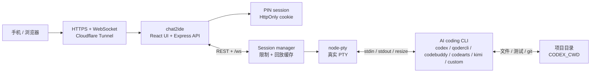
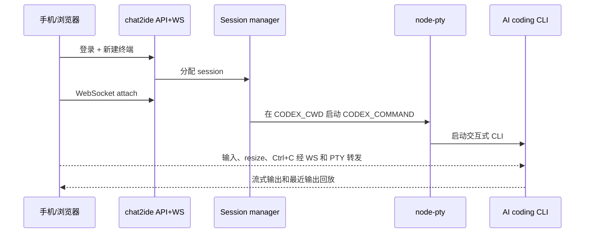

# chat2ide

自托管的 AI coding CLI 手机远程终端。用浏览器或手机接管跑在服务器上的 Codex CLI、Qoder、Claude Code、Cursor Agent、Qwen Code、CodeBuddy、Kimi Code、Aider 等终端 agent。

它不是远程桌面，也不是在线 IDE。核心是 React、xterm.js、WebSocket 和 `node-pty`：把真实 PTY session 暴露成可重连、可回放、适合移动端使用的私有 Web 控制台。

<p align="center">
  
</p>

<p align="center">
  <em>一个私有 mobile terminal，把真实 PTY 里的 AI coding session 稳定地送到浏览器和手机上。</em>
</p>

阅读其他版本：

- [English README](README.en.md)
- [完整中文文档](README.zh-CN.md)

## 适合谁搜索到这个项目

如果你在找下面这些东西，`chat2ide` 基本就是这个方向：

- 手机上远程查看和接管 Codex CLI、Qoder、Claude Code、Cursor Agent、Qwen Code 等 AI coding 任务。
- 给自托管开发机、VPS、家用服务器加一个私有 Web 终端，而不是开远程桌面。
- 用 Cloudflare Tunnel、WebSocket、`node-pty`、`xterm.js` 搭一个可重连的 mobile terminal。
- 让 Cursor、Trae、Windsurf 这类 IDE 之外的命令行 agent 可以被手机查看、输入、`Ctrl+C` 和重启。

## 这个项目解决什么

很多 AI coding 工具已经有不错的命令行版本：OpenAI Codex CLI、Claude Code、Gemini CLI、Cursor Agent、Qoder、CodeBuddy、CodeArts Agent、Kimi Code、Trae Agent、Qwen Code、Aider、Goose 等。问题是它们通常跑在电脑或服务器终端里，任务一跑久，人离开电脑后就很难继续观察和接管。

`chat2ide` 的定位很直接：

- AI coding session 仍然跑在你的服务器上。
- 每个 session 都是真实 `node-pty` PTY 进程，不是模拟终端。
- 手机或浏览器只负责显示输出、发送输入、重连和回放最近输出。
- 默认跑 `codex`，也可以通过 `CODEX_COMMAND` 接其他终端原生 CLI。

它适合个人开发者自己的 Linux 开发机、VPS、家用服务器或长期在线工作站。登录后用户拥有运行 `chat2ide` 的系统账户权限，所以它应该跑在可信机器和低权限账户下。

## 可以用来干什么

- 在手机上查看长时间运行的 AI coding 任务。
- 从底部输入栏继续给 Codex / Qoder / Claude Code 等 CLI 发指令。
- 同时保留多个终端标签，分别跑修 bug、测试、文档、部署等任务。
- 断线或刷新后重新附着当前终端，并回放最近输出。
- 用 `Ctrl+C` 中断、停止、重启或关闭指定终端。
- 通过 Cloudflare Tunnel 把本地 `127.0.0.1:3000` 安全暴露成 HTTPS 入口。

它不做这些事：

- 不远程控制 Cursor、Windsurf、Trae IDE 这类 GUI 编辑器。
- 不接管厂商云端 session 或私有侧边栏。
- 不做多人协作、企业审计、命令沙箱或权限隔离。
- 不保存完整终端历史，也不会自动脱敏终端输出。

## 技术栈

| 层 | 技术 | 作用 |
| --- | --- | --- |
| 前端工作台 | React、Vite、Tailwind CSS、xterm.js | 渲染移动端/桌面端终端、标签和底部输入栏 |
| 服务端 | Express、`ws`、TypeScript | 提供登录、终端 API 和 `/ws` WebSocket 通道 |
| 终端运行时 | `node-pty` | 启动真实服务器 PTY，让交互式 CLI 正常工作 |
| 远程入口 | Cloudflare Tunnel | 把公网 HTTPS 域名转发到本地服务 |
| 状态存储 | 进程内存、ring buffer | 保存登录 session、PTY 句柄和最近输出回放 |

## AI Coding 平台接入

`chat2ide` 的接入边界是 PTY，不是厂商 API。只要一个工具能在服务器 shell 里以 CLI 方式运行、能接收 stdin、能输出 stdout/stderr，就可以作为直接目标。

在新机器上确认一个平台已经接入时，按这四步验收：

1. 命令存在，并能返回 `--version`、`doctor`、`status` 或等价输出。
2. 同一个系统账户已经完成厂商登录或 API key 配置。
3. CLI 能从 `CODEX_CWD` 在普通终端里启动。
4. `chat2ide` 能用对应 `CODEX_COMMAND` 创建终端，并看到预期提示符或 TUI。

| 平台 | 是否直接接入 | `CODEX_COMMAND` / 参数 | 使用方式 | 参考文档 |
| --- | --- | --- | --- | --- |
| OpenAI Codex CLI | 可以 | `CODEX_COMMAND=codex` | 先运行 `codex login`，再从项目目录启动。 | [Codex CLI reference](https://developers.openai.com/codex/cli/reference) |
| Qoder CLI | 可以 | `CODEX_COMMAND=qodercli` | 安装 `@qoder-ai/qodercli`，运行 `qodercli`，再用 `/login` 或 `QODER_PERSONAL_ACCESS_TOKEN` 登录。你说的 qCoder 这里按 Qoder 处理。 | [Qoder CLI quick start](https://docs.qoder.com/en/cli/quick-start) |
| Anthropic Claude Code | 可以 | `CODEX_COMMAND=claude` | 在服务器上运行 `claude auth login` 或完成账号登录流程。 | [Claude Code CLI reference](https://code.claude.com/docs/en/cli-reference) |
| Google Gemini CLI | 可以 | `CODEX_COMMAND=gemini` | 安装 `@google/gemini-cli`，运行 `gemini`，完成 Google 登录。 | [Gemini CLI installation](https://geminicli.com/docs/get-started/installation/) |
| Cursor Agent CLI | 可以 | `CODEX_COMMAND=cursor-agent` | 安装 Cursor CLI 并登录。这里接的是终端 agent，不是远程控制 Cursor 编辑器 GUI。 | [Cursor CLI docs](https://cursor.com/docs/cli/overview) |
| Trae Agent CLI | 可以 | `CODEX_COMMAND=trae-cli`，`CODEX_ARGS=["interactive"]` | 使用开源 `trae-agent` CLI。一次性任务可以在 shell 里运行 `trae-cli run "<task>"`。 | [trae-agent README](https://github.com/bytedance/trae-agent/blob/main/README.md) |
| Qwen Code | 可以 | `CODEX_COMMAND=qwen` | 安装 `@qwen-code/qwen-code`，运行 `qwen`，再通过 `/auth` 配置账号或 API key。 | [Qwen Code](https://github.com/QwenLM/qwen-code) |
| 腾讯 CodeBuddy Code | 可以 | `CODEX_COMMAND=codebuddy` | 安装 `@tencent-ai/codebuddy-code`，确认 `codebuddy --version` 可用，再在项目目录运行 `codebuddy` 完成登录和权限确认。 | [CodeBuddy Code 安装指南](https://copilot.tencent.com/docs/cli/installation) |
| 腾讯 CloudBase AI CLI | 可以，作为统一入口 | `CODEX_COMMAND=tcb`，`CODEX_ARGS=["ai","-a","codebuddy"]` | 适合 CloudBase 或腾讯云开发场景；先登录 CloudBase CLI，再用 `tcb ai` 选择 CodeBuddy、Qwen Code 等后端工具。 | [CloudBase AI CLI](https://docs.cloudbase.net/cli-v1/ai/introduce) |
| 华为 CodeArts Agent / 码道 CLI | 可以 | `CODEX_COMMAND=codearts` | 安装码道 CLI 后，在项目目录运行 `codearts` 并通过浏览器授权；非交互任务可用 `codearts run "<message>"`。 | [快速入门](https://support.huaweicloud.com/usermanual-cli/codeartsagent_cli_0002.html) / [命令参考](https://support.huaweicloud.com/usermanual-cli/codeartsagent_cli_0034.html) |
| Kimi Code CLI | 可以 | `CODEX_COMMAND=kimi` | 安装 `@moonshot-ai/kimi-code` 或官方安装脚本，确认 `kimi --version`，首次进入后用 `/login` 登录。 | [Kimi Code 快速开始](https://www.kimi.com/code/docs/kimi-code-cli/guides/getting-started.html) |
| Kiro CLI | 可以 | `CODEX_COMMAND=kiro-cli`，`CODEX_ARGS=["chat"]` | 安装 Kiro CLI，完成浏览器登录，再从项目目录启动 chat。 | [Kiro CLI installation](https://kiro.dev/docs/cli/installation/) |
| GitHub Copilot CLI | 可以，前提是安装独立 CLI | `CODEX_COMMAND=copilot` | 安装 Copilot CLI，确认组织策略允许使用，并完成登录。如果只有 `gh copilot`，建议写 wrapper。 | [GitHub Copilot CLI](https://docs.github.com/en/copilot/how-tos/copilot-cli/cli-getting-started) |
| Aider | 可以 | `CODEX_COMMAND=aider` | 安装 `aider-chat`，配置模型/API 凭据，然后在 repo 中启动。 | [Aider installation](https://aider.chat/docs/install.html) |
| Goose CLI | 可以 | `CODEX_COMMAND=goose`，`CODEX_ARGS=["session"]` | 安装 CLI，配置 LLM provider，然后运行 `goose session`。 | [Goose installation](https://goose-docs.ai/docs/getting-started/installation/) |
| Windsurf / Devin Desktop | 间接配合 | `CODEX_COMMAND=bash` 或 `powershell` | 在 IDE 内使用 Cascade 和增强终端；`chat2ide` 负责手机侧 shell、测试、git 和其他 CLI agent。 | [Terminal and Cascade docs](https://docs.devin.ai/desktop/terminal) |
| Trae IDE | 间接配合，除非使用 `trae-agent` | 直接 PTY 控制请用 `trae-cli` | `chat2ide` 不做远程桌面，也不接管 IDE 插件状态。 | [trae-agent README](https://github.com/bytedance/trae-agent/blob/main/README.md) |

### CLI 可以接，IDE / App 不直接接

如果一个平台同时有 CLI、桌面 IDE、浏览器工作台、插件和手机 App，`chat2ide` 只接服务器上的 CLI。IDE 窗口、插件侧边栏、厂商云端 workspace 和手机 App 内的会话目前不做远程控制。

| 生态 / 产品 | CLI 接入方式 | IDE / App 当前状态 |
| --- | --- | --- |
| Cursor | `cursor-agent` 可以直接接 | Cursor IDE GUI、侧边栏和编辑器状态不接管 |
| Windsurf / Devin Desktop | 可用 `bash` / `powershell` 或其他 CLI agent 间接配合 | Cascade、桌面端窗口和 IDE 状态不接管 |
| Trae / MarsCode | `trae-cli` 可以直接接 | Trae IDE、MarsCode 云工作台和插件体验不接管 |
| Qoder | `qodercli` 可以直接接 | Qoder 的 IDE / App 形态不接管；需要终端接管时使用 CLI |
| Qwen / 通义灵码 | `qwen` 可以直接接 | 通义灵码 IDE、VS Code / JetBrains 插件和 Agent 面板等待开发 |
| 腾讯 CodeBuddy | `codebuddy` 或 `tcb ai -a codebuddy` 可以直接接 | CodeBuddy IDE、插件和 WorkBuddy 小程序不接管 |
| 华为 CodeArts | `codearts` 可以直接接 | CodeArts Snap、IDE 插件和控制台工作台不接管 |
| Kimi Code | `kimi` 可以直接接 | Kimi Code VS Code 扩展或 App 内会话不接管 |
| Gemini / Claude / Copilot | `gemini`、`claude`、`copilot` 可以直接接 | Gemini Code Assist、Claude / Copilot 的 IDE 插件或 App 会话不接管 |

### 国内平台补充状态

这些工具在国内团队里常见，但不是所有形态都能直接被 `chat2ide` 接管。判断标准仍然只有一个：有没有公开、可在 PTY 中运行的终端 CLI。

| 平台 | 当前状态 | 说明 | 参考 |
| --- | --- | --- | --- |
| 通义灵码 Lingma IDE / 插件 | 等待开发 / 间接配合 | 公开文档以 Lingma IDE、VS Code / JetBrains 插件和 Agent 模式为主，未确认独立终端 CLI。阿里系终端接入优先使用 Qoder 或 Qwen Code。 | [Lingma IDE 快速开始](https://help.aliyun.com/zh/lingma/user-guide/lingma-ide-get-started) |
| 百度 Comate / 文心快码 | 等待开发 / 间接配合 | 公开文档说明 Agent 在 Comate 插件或 Comate AI IDE 内使用；未确认可直接作为 `CODEX_COMMAND` 的独立 CLI。 | [Comate Agent 概述](https://cloud.baidu.com/doc/COMATE/s/9mm5qvpb4) |
| MarsCode / Trae IDE | 间接配合，CLI 走 `trae-agent` | MarsCode / Trae IDE 是 IDE、云工作台或插件体验；需要终端接管时使用 `trae-cli`。 | [MarsCode](https://www.marscode.com/home) |
| CodeGeeX | 等待开发 / 间接配合 | 官方产品以 IDE 插件和企业版为主，未确认官方终端原生 coding-agent CLI。 | [CodeGeeX](https://www.codegeex.cn/) |
| CodeBuddy IDE / 插件 | 间接配合，CLI 走 `codebuddy` | GUI 和插件状态不被远程控制；直接 PTY 接入使用 CodeBuddy Code CLI。 | [CodeBuddy 产品介绍](https://copilot.tencent.com/docs/ide/Introduction) |
| CodeArts Snap / IDE 插件 | 间接配合，CLI 走 `codearts` | 插件和 IDE 助手不被远程控制；直接 PTY 接入使用 CodeArts Agent / 码道 CLI。 | [CodeArts Agent CLI](https://support.huaweicloud.com/usermanual-cli/codeartsagent_cli_0001.html) |

## 常见配置

```dotenv
# Codex CLI
CODEX_COMMAND=codex
CODEX_ARGS=[]
CODEX_CWD=/srv/your-project
```

```dotenv
# Qoder CLI
CODEX_COMMAND=qodercli
CODEX_ARGS=[]
CODEX_CWD=/srv/your-project
```

```dotenv
# 腾讯 CodeBuddy Code
CODEX_COMMAND=codebuddy
CODEX_ARGS=[]
CODEX_CWD=/srv/your-project
```

```dotenv
# 腾讯 CloudBase AI CLI，使用 CodeBuddy Code
CODEX_COMMAND=tcb
CODEX_ARGS=["ai","-a","codebuddy"]
CODEX_CWD=/srv/your-project
```

```dotenv
# 华为 CodeArts Agent / 码道 CLI
CODEX_COMMAND=codearts
CODEX_ARGS=[]
CODEX_CWD=/srv/your-project
```

```dotenv
# Kimi Code CLI
CODEX_COMMAND=kimi
CODEX_ARGS=[]
CODEX_CWD=/srv/your-project
```

```dotenv
# Claude Code
CODEX_COMMAND=claude
CODEX_ARGS=[]
CODEX_CWD=/srv/your-project
```

```dotenv
# Cursor Agent CLI
CODEX_COMMAND=cursor-agent
CODEX_ARGS=[]
CODEX_CWD=/srv/your-project
```

```dotenv
# Goose CLI
CODEX_COMMAND=goose
CODEX_ARGS=["session"]
CODEX_CWD=/srv/your-project
```

如果某个平台只有桌面 GUI、浏览器工作台或 IDE 插件，没有公开终端 CLI，就不要直接写成 `CODEX_COMMAND`。这时推荐把 `CODEX_COMMAND` 设置为 `bash`/`powershell`，然后在 `chat2ide` 里运行测试、git、部署脚本，或启动另一个真正的 CLI agent。

## 快速开始

```bash
npm install
cp env.example .env
npm run dev
```

Windows PowerShell：

```powershell
npm install
Copy-Item env.example .env
npm run dev
```

开发模式会启动：

- API/WebSocket: `http://127.0.0.1:3000`
- Vite 前端: `http://127.0.0.1:5173`

## 生产部署

```bash
npm install
npm run test
npm run build
npm run start
```

最小 `.env`：

```dotenv
APP_HOST=127.0.0.1
APP_PORT=3000
APP_PUBLIC_ORIGIN=https://terminal.example.com
APP_TRUST_PROXY=1
APP_PIN_HASH=scrypt$<salt-hex>$<hash-hex>
CODEX_COMMAND=codex
CODEX_CWD=/srv/your-project
TERMINAL_MAX_SESSIONS=8
TERMINAL_MAX_INPUT_BYTES=65536
APP_WS_MAX_MESSAGE_BYTES=131072
```

部署前建议运行：

```bash
npm run preflight
```

公网访问推荐用 Cloudflare Tunnel，把域名转发到 `http://127.0.0.1:3000`。完整流程见 [Cloudflare 部署](docs/deploy-cloudflare.md)。

## 手机端体验

手机端不是缩小版桌面终端。界面保留四个重点：

- 顶部紧凑状态栏：连接状态、当前终端、未读输出、终端尺寸。
- 横向滚动终端标签：适合同时跑多个 AI coding 任务。
- 真实 xterm 输出区：ANSI、光标控制、交互式提示都保留。
- 底部输入栏：更适合手机输入命令、提示词和 `Ctrl+C`。

建议用 390 x 844 这类窄屏视口验收：

```bash
npm run build
APP_PIN=123456 CODEX_COMMAND=/bin/bash CODEX_ARGS='["-i"]' CODEX_CWD=$PWD npm run start
```

确认页面没有横向滚动，终端和底部输入栏都在首屏内，然后发送一条命令看输出。

## 架构

完整设计说明在 [docs/architecture.md](docs/architecture.md)。下面是手机接管 AI coding CLI 的最短路径。

<details>
<summary>紧凑通信架构</summary>





</details>

## 待接入 / 改进方向

这些不是当前承诺已经完成的功能，而是后续可以继续增强的方向：

- 平台预设：在 UI 或配置里直接选择 Codex、Qoder、CodeBuddy、CodeArts、Kimi、Qwen Code、Claude Code、Gemini、Cursor Agent 等常用 CLI。
- 国内平台跟进：通义灵码、文心快码、MarsCode、CodeGeeX 等如果发布可独立运行的终端 CLI，再补成直接接入预设。
- Qoder 专项验收：增加 `qodercli` 的 smoke test 文档或脚本，覆盖安装、登录、启动、终端输出四步。
- Wrapper 模板：提供 `scripts/run-qoder.sh`、`scripts/run-claude.sh` 等示例，方便带参数启动不同 agent。
- 任务通知：长任务完成、终端异常退出、后台有未读输出时推送通知。
- 持久化可选项：可选保存终端元信息或最近任务摘要，但默认仍保持轻量和低状态。
- 移动端继续打磨：更好的多终端切换、输入历史、常用命令面板和小屏键盘适配。
- 安全增强：更细的命令风险提示、只读模式、项目目录白名单和部署检查项。

## 文档

- [产品与场景](docs/product.md)
- [配置说明](docs/configuration.md)
- [使用指南](docs/user-guide.md)
- [架构](docs/architecture.md)
- [协议](docs/protocol.md)
- [安全边界](docs/security.md)
- [Cloudflare 部署](docs/deploy-cloudflare.md)
- [开发指南](docs/dev-guide.md)
- [运维手册](docs/operations.md)
- [手工验收](docs/manual-test-plan.md)
- [故障排查](docs/troubleshooting.md)
- [贡献指南](CONTRIBUTING.md)
- [安全策略](SECURITY.md)
