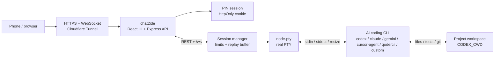
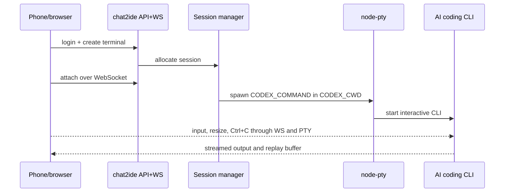

# chat2ide

Self-hosted web and mobile terminal for long-running Codex CLI sessions.

  

  <em>A phone-friendly control surface for real server-side AI coding CLI sessions.</em>

Read the full README in:

- [English](README.en.md)
- [简体中文](README.zh-CN.md)

In short, this repository runs AI coding CLIs as real server-side PTY processes and lets one authenticated user control them from a browser or phone. Codex CLI is the default target, and `CODEX_COMMAND` can point at any PTY-friendly coding agent or shell wrapper that can run on the host.

It is for a trusted personal server, not for multi-user IDE hosting.

## Stack

| Layer | Technology |
| --- | --- |
| Browser UI | React, Vite, Tailwind CSS, xterm.js |
| Server | Express, ws, TypeScript |
| Terminal runtime | node-pty with real PTY sessions |
| Remote access | Cloudflare Tunnel to a local `127.0.0.1` service |
| State | In-memory sessions, process handles, and ring buffers |

## AI Coding Tool Support

`chat2ide` can directly host terminal-native agents. A platform is a direct target only when it exposes a command that can run inside a server PTY, accept stdin, and stream output to stdout/stderr. GUI-only editors can share the same repo and machine, but `chat2ide` cannot drive editor windows, proprietary sidebars, browser workspaces, or vendor cloud sessions.

Before claiming an integration is ready on a new host, verify:

1. The vendor command is installed and returns `--version`, `doctor`, `status`, or equivalent output.
2. The vendor CLI is authenticated on the server account that runs `chat2ide`.
3. The CLI can start from `CODEX_CWD` in a normal terminal.
4. `chat2ide` can create a terminal with that `CODEX_COMMAND` and show the expected prompt or TUI.

| Tool | Direct target? | `CODEX_COMMAND` / args | Setup notes | Reference docs |
| --- | --- | --- | --- | --- |
| OpenAI Codex CLI | Yes | `CODEX_COMMAND=codex` | Run `codex login`, then start from the project directory. | [Codex CLI reference](https://developers.openai.com/codex/cli/reference) |
| Anthropic Claude Code | Yes | `CODEX_COMMAND=claude` | Run `claude auth login` or the account login flow before exposing it through chat2ide. | [Claude Code CLI reference](https://code.claude.com/docs/en/cli-reference) |
| Google Gemini CLI | Yes | `CODEX_COMMAND=gemini` | Install `@google/gemini-cli`, run `gemini`, and complete Google authentication. | [Gemini CLI installation](https://geminicli.com/docs/get-started/installation/) |
| Cursor Agent CLI | Yes | `CODEX_COMMAND=cursor-agent` | Install Cursor CLI on the host and authenticate it. This targets the terminal agent, not the Cursor editor GUI. | [Cursor CLI docs](https://cursor.com/docs/cli/overview) |
| Qoder CLI | Yes | `CODEX_COMMAND=qodercli` | Install `@qoder-ai/qodercli`, run `qodercli`, then use `/login` or `QODER_PERSONAL_ACCESS_TOKEN`. | [Qoder CLI quick start](https://docs.qoder.com/en/cli/quick-start) |
| Trae Agent CLI | Yes | `CODEX_COMMAND=trae-cli`, `CODEX_ARGS=["interactive"]` | Use the open-source `trae-agent` CLI. For one-off tasks, run `trae-cli run "<task>"` inside a shell or wrap it. | [trae-agent](https://github.com/bytedance/trae-agent) |
| Qwen Code | Yes | `CODEX_COMMAND=qwen` | Install `@qwen-code/qwen-code`, run `qwen`, then configure `/auth` with a supported provider or API key. | [Qwen Code](https://github.com/QwenLM/qwen-code) |
| Kiro CLI | Yes | `CODEX_COMMAND=kiro-cli`, `CODEX_ARGS=["chat"]` | Install Kiro CLI, authenticate in the browser flow, then launch chat from the project directory. | [Kiro CLI installation](https://kiro.dev/docs/cli/installation/) |
| GitHub Copilot CLI | Yes, if the standalone CLI is installed | `CODEX_COMMAND=copilot` | Install Copilot CLI, ensure org policy allows it, and sign in. If you only have `gh copilot`, use a wrapper command. | [GitHub Copilot CLI](https://docs.github.com/en/copilot/how-tos/copilot-cli/cli-getting-started) |
| Aider | Yes | `CODEX_COMMAND=aider` | Install `aider-chat`, set the model/API credentials, then start it in the repo. | [Aider installation](https://aider.chat/docs/install.html) |
| Goose CLI | Yes | `CODEX_COMMAND=goose`, `CODEX_ARGS=["session"]` | Install the CLI, configure an LLM provider, then run `goose session`. | [Goose installation](https://goose-docs.ai/docs/getting-started/installation/) |
| Windsurf / Devin Desktop | Indirect | `CODEX_COMMAND=bash` or `powershell` | Use Cascade and the enhanced terminal inside the IDE. Use `chat2ide` beside it for mobile shell, tests, git, and other CLI agents on the same repo. | [Terminal and Cascade docs](https://docs.devin.ai/desktop/terminal) |
| Trae IDE | Indirect unless using `trae-agent` | Use `trae-cli` for direct PTY control | The IDE GUI cannot be driven by chat2ide. Use the CLI agent when mobile handoff is needed. | [trae-agent](https://github.com/bytedance/trae-agent) |
| qCoder / QCoder-named tools | Only if they expose a real CLI | Point `CODEX_COMMAND` at that binary | The name is ambiguous. If you mean Qoder, use `qodercli`; otherwise validate the local `qcoder` command like any other PTY program. | [Qoder CLI quick start](https://docs.qoder.com/en/cli/quick-start) if this means Qoder; otherwise the specific vendor docs |

Compact communication architecture

