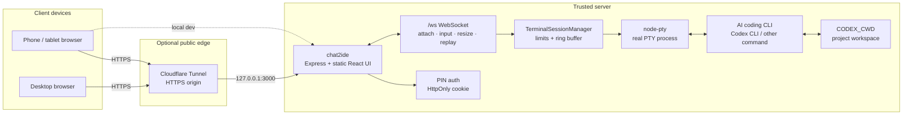

# chat2ide

Self-hosted web and mobile terminal for long-running Codex CLI sessions.

  

  <em>A phone-friendly control surface for real server-side AI coding CLI sessions.</em>

Read the full README in:

- [English](README.en.md)
- [简体中文](README.zh-CN.md)

In short, this repository runs AI coding CLIs as real server-side PTY processes and lets one authenticated user control them from a browser or phone. Codex CLI is the default target, and `CODEX_COMMAND` can point at another PTY-friendly coding agent or shell wrapper.

It is for a trusted personal server, not for multi-user IDE hosting.

## Communication Architecture

## Stack

| Layer | Technology |
| --- | --- |
| Browser UI | React, Vite, Tailwind CSS, xterm.js |
| Server | Express, ws, TypeScript |
| Terminal runtime | node-pty with real PTY sessions |
| Remote access | Cloudflare Tunnel to a local `127.0.0.1` service |
| State | In-memory sessions, process handles, and ring buffers |
