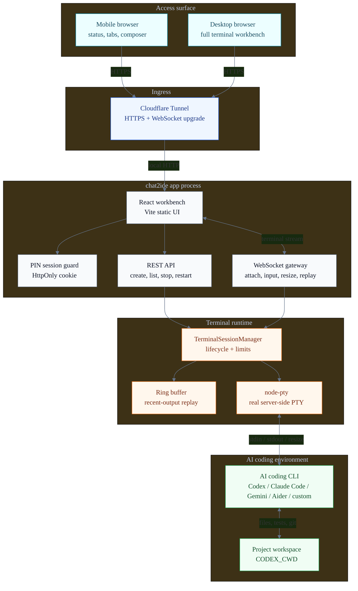
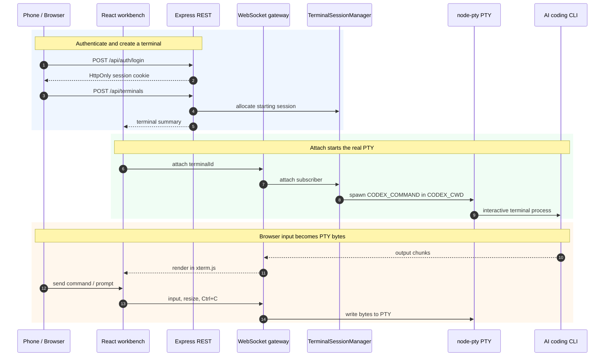

# chat2ide

`chat2ide` 是一个自托管的单用户 Codex CLI 远程终端。它在服务器上启动真实 PTY 进程，然后把终端画面、输入、重连和最近输出回放放到浏览器里。

它解决的是一个很具体的问题：你有一台可信的 Linux 开发机、VPS 或家用服务器，Codex CLI 已经能在上面跑。你想从电脑、平板或手机查看任务，必要时发一条指令、按 `Ctrl+C`、重启或关闭终端。

## 界面预览

<p align="center">
  
</p>

手机端不是把桌面终端强行缩小，而是把状态概览、终端标签、真实 xterm 输出和底部输入栏放在一个可接管长任务的工作台里。

## 这个仓库可以做什么

- 用 PIN 登录一个私有 Web 控制台。
- 创建多个独立 Codex CLI 终端标签。
- 通过 `xterm.js` 显示真实终端输出，包括 ANSI、光标控制和交互式提示。
- 在手机底部输入栏发送命令或提示词，不需要依赖手机键盘直接操作 xterm。
- 顶部显示终端总数、运行/启动/停止/异常数量、后台未读输出和当前终端尺寸。
- 底部输入栏保留本次浏览器会话内最近 30 条已发送命令，单行输入可用方向键快速复用；历史不写入本地存储。
- 页面刷新或网络短断后重新连接，并回放每个终端最近的输出。
- 关闭当前终端后自动落到相邻标签，减少多任务切换时的跳动。
- 通过 Cloudflare Tunnel 暴露 HTTPS 入口，不直接开放服务器端口。
- 用配置限制终端数量、单次输入大小和 WebSocket 消息大小。
- 不使用数据库。登录 session、终端进程和输出缓存都在当前服务进程内存里。

## 技术栈和 AI 编程工具接入方式

| 层 | 技术 | 作用 |
| --- | --- | --- |
| 前端工作台 | React、Vite、Tailwind CSS、xterm.js | 渲染移动端/桌面端控制台、终端标签和真实 ANSI 终端输出 |
| 服务端 | Express、`ws`、TypeScript | 提供登录、终端管理 API 和 `/ws` WebSocket 通道 |
| 终端运行时 | `node-pty` | 在服务器上启动真实 PTY，让交互式 CLI 以为自己在标准终端里运行 |
| 远程入口 | Cloudflare Tunnel | 把公网 HTTPS 域名转发到服务器本地 `127.0.0.1:3000` |
| 状态存储 | 进程内存、ring buffer | 保存登录 session、PTY 进程句柄和最近输出回放 |

默认命令是 `codex`。如果你想接入 Claude Code、Gemini CLI、Aider 或自己的 AI coding wrapper，可以把 `CODEX_COMMAND` 指向对应命令，用 `CODEX_ARGS` 配启动参数。`chat2ide` 不调用这些工具的私有 API；它只负责把手机/浏览器输入通过 WebSocket 写入真实 PTY，再把 PTY 输出流式送回网页。

## 不适合什么

- 多用户团队 IDE。
- 企业审计终端。
- 命令执行沙箱。
- 文件权限系统或项目级 ACL。
- 服务重启后恢复进程和完整日志的系统。
- 需要自动脱敏终端内容的生产控制台。

登录后，用户等价于拿到了运行 `chat2ide` 的系统账户权限。请用低权限账户运行，并把 `CODEX_CWD` 指向具体项目目录。

## 通信架构



## 使用流程



新建终端时，服务端先保存一个 `starting` 会话。浏览器通过 WebSocket 附着后，服务端才启动 PTY。这样启动阶段的交互式输出会先进入真实 xterm 视图。

## 要求

- Node.js 20.19+ 和 npm。
- 一台可长期运行服务的 Linux 机器。
- 服务器上已经安装并登录可用的 Codex CLI，或用 `CODEX_COMMAND` 指向等价命令。
- 一个项目目录作为 `CODEX_CWD`。
- 生产访问建议使用 Cloudflare Tunnel 和自有域名。

Windows 可以用于本地开发和 smoke test。生产环境仍建议放在 Linux 上，`node-pty` 和交互式 CLI 在 Linux 上更稳定。

## 本地开发

```bash
npm install
cp env.example .env
npm run dev
```

Windows PowerShell:

```powershell
npm install
Copy-Item env.example .env
npm run dev
```

开发模式会启动：

- API/WebSocket: `http://127.0.0.1:3000`
- Vite 前端: `http://127.0.0.1:5173`

## 生产构建

```bash
npm install
npm run test
npm run build
npm run start
```

Linux 服务器也可以使用脚本：

```bash
./scripts/bootstrap.sh
./scripts/test.sh
./scripts/dev.sh start
```

## 最小配置

复制 `env.example` 为 `.env` 后，至少确认这些值：

```dotenv
APP_HOST=127.0.0.1
APP_PORT=3000
APP_PUBLIC_ORIGIN=https://terminal.example.com
APP_TRUST_PROXY=1
APP_PIN_HASH=scrypt$<salt-hex>$<hash-hex>
CODEX_COMMAND=codex
CODEX_CWD=/srv/your-project
TERMINAL_MAX_SESSIONS=8
TERMINAL_MAX_INPUT_BYTES=65536
APP_WS_MAX_MESSAGE_BYTES=131072
```

本地开发可以临时使用明文 PIN：

```dotenv
APP_PIN=123456
```

生产环境使用 `APP_PIN_HASH`。生成方式：

```bash
node -e 'const c=require("crypto");const pin=process.argv[1];const salt=c.randomBytes(16);const hash=c.scryptSync(pin,salt,32);console.log(`scrypt$${salt.toString("hex")}$${hash.toString("hex")}`)' 123456
```

部署前运行：

```bash
npm run preflight
```

它会检查 Node、`node-pty`、PIN、`CODEX_CWD`、`CODEX_ARGS`、`CODEX_COMMAND`、PTY runtime、`APP_PUBLIC_ORIGIN`、PIN hash 和资源上限。默认 PIN 或缺少公网 origin 会显示 warning。

## Cloudflare Tunnel

推荐拓扑是 `cloudflared` 在服务器上运行，把公网域名转发到 `http://127.0.0.1:3000`。

```yaml
tunnel: chat2ide
credentials-file: /etc/cloudflared/chat2ide.json

ingress:
  - hostname: terminal.example.com
    service: http://127.0.0.1:3000
  - service: http_status:404
```

HTTP API 和 WebSocket 使用同一个 origin，WebSocket 路径是 `/ws`。完整部署步骤见 [Cloudflare 部署](docs/deploy-cloudflare.md)。

## 使用方式

1. 打开部署后的网址。
2. 输入服务器配置的 PIN。
3. 点击“新建终端”。
4. 在底部输入栏发送命令或提示词。
5. 用标签页切换不同任务。
6. 用 `Ctrl+C` 中断当前命令，用“停止”结束进程，用“重启”清屏并启动新 PTY，用“关闭”删除标签页。
7. 刷新页面或断线恢复后，页面会重新附着当前终端并回放最近输出。

手机端优先使用底部输入栏。标签页可以横向滚动；顶部概览用于快速判断是否有后台输出、异常终端或正在启动的会话。

## 移动端验收

建议用 390 x 844 这类窄屏视口检查：

```bash
npm run build
APP_PIN=123456 CODEX_COMMAND=/bin/bash CODEX_ARGS='["-i"]' CODEX_CWD=$PWD npm run start
```

Windows PowerShell:

```powershell
npm run build
$env:APP_PIN="123456"; $env:CODEX_COMMAND="powershell.exe"; $env:CODEX_ARGS='["-NoLogo"]'; $env:CODEX_CWD=$PWD; npm run start
```

打开 `http://127.0.0.1:3000`，确认页面没有横向滚动，顶部概览不会挤压到不可用，终端区和底部输入区都在首屏内，然后实际发送一条命令看输出。再发送第二条命令，并在单行输入状态下用方向键检查本次会话的命令历史是否能回填。

## 运维边界

- `/api/health` 可用于基础健康检查。
- 服务重启会清空登录 session、PTY 进程和 ring buffer。
- ring buffer 只保存最近输出，不是完整日志。
- `TERMINAL_MAX_SESSIONS`、`TERMINAL_MAX_INPUT_BYTES` 和 `APP_WS_MAX_MESSAGE_BYTES` 是防误用边界，不是沙箱。

## 文档

- [产品与场景](docs/product.md)
- [配置说明](docs/configuration.md)
- [使用指南](docs/user-guide.md)
- [架构](docs/architecture.md)
- [协议](docs/protocol.md)
- [安全边界](docs/security.md)
- [Cloudflare 部署](docs/deploy-cloudflare.md)
- [开发指南](docs/dev-guide.md)
- [运维手册](docs/operations.md)
- [手工验收](docs/manual-test-plan.md)
- [故障排查](docs/troubleshooting.md)
- [贡献指南](CONTRIBUTING.md)
- [安全策略](SECURITY.md)
