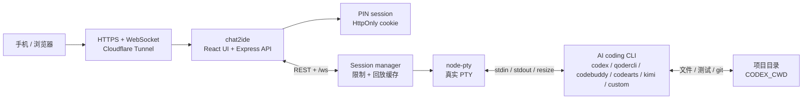
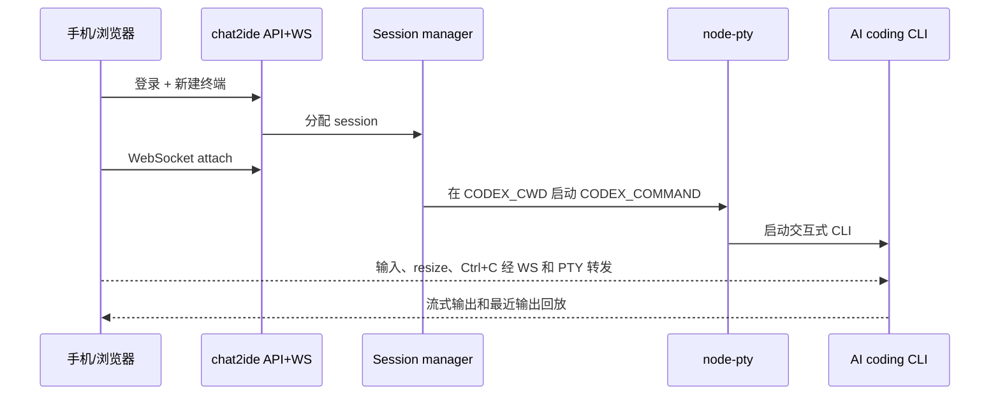

# chat2ide

`chat2ide` 是一个自托管的单用户 Codex CLI 远程终端。它在服务器上启动真实 PTY 进程，然后把终端画面、输入、重连和最近输出回放放到浏览器里。

它解决的是一个很具体的问题：你有一台可信的 Linux 开发机、VPS 或家用服务器，Codex CLI 已经能在上面跑。你想从电脑、平板或手机查看任务，必要时发一条指令、按 `Ctrl+C`、重启或关闭终端。

## 界面预览

<p align="center">
  
</p>

手机端不是把桌面终端强行缩小，而是把紧凑 session 状态栏、终端标签、真实 xterm 输出和底部输入栏放在一个可接管长任务的工作台里。

## 这个仓库可以做什么

- 用 PIN 登录一个私有 Web 控制台。
- 创建多个独立 Codex CLI 终端标签。
- 通过 `xterm.js` 显示真实终端输出，包括 ANSI、光标控制和交互式提示。
- 在手机底部输入栏发送命令或提示词，不需要依赖手机键盘直接操作 xterm。
- 顶部显示终端总数、运行/启动/停止/异常数量、后台未读输出和当前终端尺寸。
- 底部输入栏保留本次浏览器会话内最近 30 条已发送命令，单行输入可用方向键快速复用；历史不写入本地存储。
- 页面刷新或网络短断后重新连接，并回放每个终端最近的输出。
- 关闭当前终端后自动落到相邻标签，减少多任务切换时的跳动。
- 通过 Cloudflare Tunnel 暴露 HTTPS 入口，不直接开放服务器端口。
- 用配置限制终端数量、单次输入大小和 WebSocket 消息大小。
- 不使用数据库。登录 session、终端进程和输出缓存都在当前服务进程内存里。

## 技术栈和 AI 编程工具接入方式

| 层 | 技术 | 作用 |
| --- | --- | --- |
| 前端工作台 | React、Vite、Tailwind CSS、xterm.js | 渲染移动端/桌面端控制台、终端标签和真实 ANSI 终端输出 |
| 服务端 | Express、`ws`、TypeScript | 提供登录、终端管理 API 和 `/ws` WebSocket 通道 |
| 终端运行时 | `node-pty` | 在服务器上启动真实 PTY，让交互式 CLI 以为自己在标准终端里运行 |
| 远程入口 | Cloudflare Tunnel | 把公网 HTTPS 域名转发到服务器本地 `127.0.0.1:3000` |
| 状态存储 | 进程内存、ring buffer | 保存登录 session、PTY 进程句柄和最近输出回放 |

默认命令是 `codex`。如果你想接入其他 AI coding 工具，可以把 `CODEX_COMMAND` 指向一个真实存在的终端命令，用 `CODEX_ARGS` 配启动参数。`chat2ide` 不调用厂商私有 API；它只负责把手机/浏览器输入通过 WebSocket 写入真实 PTY，再把 PTY 输出流式送回网页。

## AI Coding 平台接入方式

`chat2ide` 支持的是“终端原生”的 AI coding agent：工具必须能在服务器 shell 里以 CLI 方式运行，并且能在 PTY 里接收 stdin、输出 stdout/stderr。GUI 编辑器本身可以和 `chat2ide` 共用同一个项目目录，但 `chat2ide` 不会远程操控编辑器窗口、插件侧边栏、浏览器工作台或云端私有会话。

在一台新机器上声称“接入完成”之前，至少确认四件事：厂商命令存在、同一个系统账户下已经完成登录、CLI 能从 `CODEX_CWD` 在普通终端里启动、`chat2ide` 能用这个 `CODEX_COMMAND` 创建终端并看到预期提示符或 TUI。

| 平台 | 是否直接接入 | `CODEX_COMMAND` / 参数 | 推荐接入方式 | 参考文档 |
| --- | --- | --- | --- | --- |
| OpenAI Codex CLI | 可以 | `CODEX_COMMAND=codex` | 先运行 `codex login`，再从项目目录启动。 | [Codex CLI reference](https://developers.openai.com/codex/cli/reference) |
| Anthropic Claude Code | 可以 | `CODEX_COMMAND=claude` | 在服务器上运行 `claude auth login` 或完成账号登录流程。 | [Claude Code CLI reference](https://code.claude.com/docs/en/cli-reference) |
| Google Gemini CLI | 可以 | `CODEX_COMMAND=gemini` | 安装 `@google/gemini-cli`，运行 `gemini`，完成 Google 登录。 | [Gemini CLI installation](https://geminicli.com/docs/get-started/installation/) |
| Cursor Agent CLI | 可以 | `CODEX_COMMAND=cursor-agent` | 安装 Cursor CLI 并登录。这里接的是终端 agent，不是远程控制 Cursor 编辑器 GUI。 | [Cursor CLI docs](https://cursor.com/docs/cli/overview) |
| Qoder CLI | 可以 | `CODEX_COMMAND=qodercli` | 安装 `@qoder-ai/qodercli`，运行 `qodercli`，再用 `/login` 或 `QODER_PERSONAL_ACCESS_TOKEN` 登录。本项目里提到 qCoder 时，统一按 Qoder 理解。 | [Qoder CLI quick start](https://docs.qoder.com/en/cli/quick-start) |
| Trae Agent CLI | 可以 | `CODEX_COMMAND=trae-cli`，`CODEX_ARGS=["interactive"]` | 使用开源 `trae-agent` CLI。一次性任务可以在 shell 里运行 `trae-cli run "<task>"`，或写 wrapper。 | [trae-agent README](https://github.com/bytedance/trae-agent/blob/main/README.md) |
| Qwen Code | 可以 | `CODEX_COMMAND=qwen` | 安装 `@qwen-code/qwen-code`，运行 `qwen`，再通过 `/auth` 配置账号或 API key。 | [Qwen Code](https://github.com/QwenLM/qwen-code) |
| 腾讯 CodeBuddy Code | 可以 | `CODEX_COMMAND=codebuddy` | 安装 `@tencent-ai/codebuddy-code`，确认 `codebuddy --version` 可用，再在项目目录运行 `codebuddy` 完成登录和权限确认。 | [CodeBuddy Code 安装指南](https://copilot.tencent.com/docs/cli/installation) |
| 腾讯 CloudBase AI CLI | 可以，作为统一入口 | `CODEX_COMMAND=tcb`，`CODEX_ARGS=["ai","-a","codebuddy"]` | 适合 CloudBase 或腾讯云开发场景；先登录 CloudBase CLI，再用 `tcb ai` 选择 CodeBuddy、Qwen Code 等后端工具。 | [CloudBase AI CLI](https://docs.cloudbase.net/cli-v1/ai/introduce) |
| 华为 CodeArts Agent / 码道 CLI | 可以 | `CODEX_COMMAND=codearts` | 安装码道 CLI 后，在项目目录运行 `codearts` 并通过浏览器授权；非交互任务可用 `codearts run "<message>"`。 | [快速入门](https://support.huaweicloud.com/usermanual-cli/codeartsagent_cli_0002.html) / [命令参考](https://support.huaweicloud.com/usermanual-cli/codeartsagent_cli_0034.html) |
| Kimi Code CLI | 可以 | `CODEX_COMMAND=kimi` | 安装 `@moonshot-ai/kimi-code` 或官方安装脚本，确认 `kimi --version`，首次进入后用 `/login` 登录。 | [Kimi Code 快速开始](https://www.kimi.com/code/docs/kimi-code-cli/guides/getting-started.html) |
| Kiro CLI | 可以 | `CODEX_COMMAND=kiro-cli`，`CODEX_ARGS=["chat"]` | 安装 Kiro CLI，完成浏览器登录，再从项目目录启动 chat。 | [Kiro CLI installation](https://kiro.dev/docs/cli/installation/) |
| GitHub Copilot CLI | 可以，前提是安装独立 CLI | `CODEX_COMMAND=copilot` | 安装 Copilot CLI，确认组织策略允许使用，并完成登录。如果只有 `gh copilot`，建议用 wrapper 脚本。 | [GitHub Copilot CLI](https://docs.github.com/en/copilot/how-tos/copilot-cli/cli-getting-started) |
| Aider | 可以 | `CODEX_COMMAND=aider` | 安装 `aider-chat`，配置模型/API 凭据，然后在 repo 中启动。 | [Aider installation](https://aider.chat/docs/install.html) |
| Goose CLI | 可以 | `CODEX_COMMAND=goose`，`CODEX_ARGS=["session"]` | 安装 CLI，配置 LLM provider，然后运行 `goose session`。 | [Goose installation](https://goose-docs.ai/docs/getting-started/installation/) |
| Windsurf / Devin Desktop | 间接配合 | `CODEX_COMMAND=bash` 或 `powershell` | 在 IDE 内使用 Cascade 和增强终端；`chat2ide` 用来从手机查看同一仓库的 shell、测试、git 和其他 CLI agent。 | [Terminal and Cascade docs](https://docs.devin.ai/desktop/terminal) |
| Trae IDE | 间接配合，除非使用 `trae-agent` | 直接 PTY 控制请用 `trae-cli` | `chat2ide` 不做远程桌面，也不接管 IDE 插件状态。 | [trae-agent README](https://github.com/bytedance/trae-agent/blob/main/README.md) |

### 国内平台补充状态

这些工具在国内团队里常见，但不是所有形态都能直接被 `chat2ide` 接管。判断标准仍然只有一个：有没有公开、可在 PTY 中运行的终端 CLI。

| 平台 | 当前状态 | 说明 | 参考 |
| --- | --- | --- | --- |
| 通义灵码 Lingma IDE / 插件 | 等待开发 / 间接配合 | 公开文档以 Lingma IDE、VS Code / JetBrains 插件和 Agent 模式为主，未确认独立终端 CLI。阿里系终端接入优先使用 Qoder 或 Qwen Code。 | [Lingma IDE 快速开始](https://help.aliyun.com/zh/lingma/user-guide/lingma-ide-get-started) |
| 百度 Comate / 文心快码 | 等待开发 / 间接配合 | 公开文档说明 Agent 在 Comate 插件或 Comate AI IDE 内使用；未确认可直接作为 `CODEX_COMMAND` 的独立 CLI。 | [Comate Agent 概述](https://cloud.baidu.com/doc/COMATE/s/9mm5qvpb4) |
| MarsCode / Trae IDE | 间接配合，CLI 走 `trae-agent` | MarsCode / Trae IDE 是 IDE、云工作台或插件体验；需要终端接管时使用 `trae-cli`。 | [MarsCode](https://www.marscode.com/home) |
| CodeGeeX | 等待开发 / 间接配合 | 官方产品以 IDE 插件和企业版为主，未确认官方终端原生 coding-agent CLI。 | [CodeGeeX](https://www.codegeex.cn/) |
| CodeBuddy IDE / 插件 | 间接配合，CLI 走 `codebuddy` | GUI 和插件状态不被远程控制；直接 PTY 接入使用 CodeBuddy Code CLI。 | [CodeBuddy 产品介绍](https://copilot.tencent.com/docs/ide/Introduction) |
| CodeArts Snap / IDE 插件 | 间接配合，CLI 走 `codearts` | 插件和 IDE 助手不被远程控制；直接 PTY 接入使用 CodeArts Agent / 码道 CLI。 | [CodeArts Agent CLI](https://support.huaweicloud.com/usermanual-cli/codeartsagent_cli_0001.html) |

常见配置：

```dotenv
# Codex CLI
CODEX_COMMAND=codex
CODEX_ARGS=[]
CODEX_CWD=/srv/your-project
```

```dotenv
# Cursor Agent CLI
CODEX_COMMAND=cursor-agent
CODEX_ARGS=[]
CODEX_CWD=/srv/your-project
```

```dotenv
# Claude Code
CODEX_COMMAND=claude
CODEX_ARGS=[]
CODEX_CWD=/srv/your-project
```

```dotenv
# Gemini CLI
CODEX_COMMAND=gemini
CODEX_ARGS=[]
CODEX_CWD=/srv/your-project
```

```dotenv
# Qoder CLI
CODEX_COMMAND=qodercli
CODEX_ARGS=[]
CODEX_CWD=/srv/your-project
```

```dotenv
# Trae Agent wrapper：scripts/run-trae-agent.sh 内部可以调用 trae-cli run 或进入交互 shell
CODEX_COMMAND=/srv/chat2ide/scripts/run-trae-agent.sh
CODEX_ARGS=[]
CODEX_CWD=/srv/your-project
```

```dotenv
# Qwen Code
CODEX_COMMAND=qwen
CODEX_ARGS=[]
CODEX_CWD=/srv/your-project
```

```dotenv
# 腾讯 CodeBuddy Code
CODEX_COMMAND=codebuddy
CODEX_ARGS=[]
CODEX_CWD=/srv/your-project
```

```dotenv
# 腾讯 CloudBase AI CLI，使用 CodeBuddy Code
CODEX_COMMAND=tcb
CODEX_ARGS=["ai","-a","codebuddy"]
CODEX_CWD=/srv/your-project
```

```dotenv
# 华为 CodeArts Agent / 码道 CLI
CODEX_COMMAND=codearts
CODEX_ARGS=[]
CODEX_CWD=/srv/your-project
```

```dotenv
# Kimi Code CLI
CODEX_COMMAND=kimi
CODEX_ARGS=[]
CODEX_CWD=/srv/your-project
```

```dotenv
# Kiro CLI chat
CODEX_COMMAND=kiro-cli
CODEX_ARGS=["chat"]
CODEX_CWD=/srv/your-project
```

```dotenv
# GitHub Copilot CLI
CODEX_COMMAND=copilot
CODEX_ARGS=[]
CODEX_CWD=/srv/your-project
```

```dotenv
# Aider
CODEX_COMMAND=aider
CODEX_ARGS=[]
CODEX_CWD=/srv/your-project
```

```dotenv
# Goose CLI
CODEX_COMMAND=goose
CODEX_ARGS=["session"]
CODEX_CWD=/srv/your-project
```

如果某个平台只有桌面 GUI、浏览器工作台或 IDE 插件，没有公开的终端 CLI，就不要把它直接写成 `CODEX_COMMAND`。这时推荐把 `CODEX_COMMAND` 设置为 `bash`/`powershell`，然后在 `chat2ide` 里运行测试、git、部署脚本，或者启动另一个真正的 CLI agent。

## 不适合什么

- 多用户团队 IDE。
- 企业审计终端。
- 命令执行沙箱。
- 文件权限系统或项目级 ACL。
- 服务重启后恢复进程和完整日志的系统。
- 需要自动脱敏终端内容的生产控制台。

登录后，用户等价于拿到了运行 `chat2ide` 的系统账户权限。请用低权限账户运行，并把 `CODEX_CWD` 指向具体项目目录。

## 要求

- Node.js 20.19+ 和 npm。
- 一台可长期运行服务的 Linux 机器。
- 服务器上已经安装并登录可用的 Codex CLI，或用 `CODEX_COMMAND` 指向等价命令。
- 一个项目目录作为 `CODEX_CWD`。
- 生产访问建议使用 Cloudflare Tunnel 和自有域名。

Windows 可以用于本地开发和 smoke test。生产环境仍建议放在 Linux 上，`node-pty` 和交互式 CLI 在 Linux 上更稳定。

## 本地开发

```bash
npm install
cp env.example .env
npm run dev
```

Windows PowerShell:

```powershell
npm install
Copy-Item env.example .env
npm run dev
```

开发模式会启动：

- API/WebSocket: `http://127.0.0.1:3000`
- Vite 前端: `http://127.0.0.1:5173`

## 生产构建

```bash
npm install
npm run test
npm run build
npm run start
```

Linux 服务器也可以使用脚本：

```bash
./scripts/bootstrap.sh
./scripts/test.sh
./scripts/dev.sh start
```

## 最小配置

复制 `env.example` 为 `.env` 后，至少确认这些值：

```dotenv
APP_HOST=127.0.0.1
APP_PORT=3000
APP_PUBLIC_ORIGIN=https://terminal.example.com
APP_TRUST_PROXY=1
APP_PIN_HASH=scrypt$<salt-hex>$<hash-hex>
CODEX_COMMAND=codex
CODEX_CWD=/srv/your-project
TERMINAL_MAX_SESSIONS=8
TERMINAL_MAX_INPUT_BYTES=65536
APP_WS_MAX_MESSAGE_BYTES=131072
```

本地开发可以临时使用明文 PIN：

```dotenv
APP_PIN=123456
```

生产环境使用 `APP_PIN_HASH`。生成方式：

```bash
node -e 'const c=require("crypto");const pin=process.argv[1];const salt=c.randomBytes(16);const hash=c.scryptSync(pin,salt,32);console.log(`scrypt$${salt.toString("hex")}$${hash.toString("hex")}`)' 123456
```

部署前运行：

```bash
npm run preflight
```

它会检查 Node、`node-pty`、PIN、`CODEX_CWD`、`CODEX_ARGS`、`CODEX_COMMAND`、PTY runtime、`APP_PUBLIC_ORIGIN`、PIN hash 和资源上限。默认 PIN 或缺少公网 origin 会显示 warning。

## Cloudflare Tunnel

推荐拓扑是 `cloudflared` 在服务器上运行，把公网域名转发到 `http://127.0.0.1:3000`。

```yaml
tunnel: chat2ide
credentials-file: /etc/cloudflared/chat2ide.json

ingress:
  - hostname: terminal.example.com
    service: http://127.0.0.1:3000
  - service: http_status:404
```

HTTP API 和 WebSocket 使用同一个 origin，WebSocket 路径是 `/ws`。完整部署步骤见 [Cloudflare 部署](docs/deploy-cloudflare.md)。

## 使用方式

1. 打开部署后的网址。
2. 输入服务器配置的 PIN。
3. 点击“新建终端”。
4. 在底部输入栏发送命令或提示词。
5. 用标签页切换不同任务。
6. 用 `Ctrl+C` 中断当前命令，用“停止”结束进程，用“重启”清屏并启动新 PTY，用“关闭”删除标签页。
7. 刷新页面或断线恢复后，页面会重新附着当前终端并回放最近输出。

手机端优先使用底部输入栏。标签页可以横向滚动；顶部紧凑状态栏用于快速判断连接状态、当前终端、未读数和终端尺寸。

## 移动端验收

建议用 390 x 844 这类窄屏视口检查：

```bash
npm run build
APP_PIN=123456 CODEX_COMMAND=/bin/bash CODEX_ARGS='["-i"]' CODEX_CWD=$PWD npm run start
```

Windows PowerShell:

```powershell
npm run build
$env:APP_PIN="123456"; $env:CODEX_COMMAND="powershell.exe"; $env:CODEX_ARGS='["-NoLogo"]'; $env:CODEX_CWD=$PWD; npm run start
```

打开 `http://127.0.0.1:3000`，确认页面没有横向滚动，顶部状态栏不会挤压终端区，终端区和底部输入区都在首屏内，然后实际发送一条命令看输出。再发送第二条命令，并在单行输入状态下用方向键检查本次会话的命令历史是否能回填。

## 架构

完整设计说明在 [docs/architecture.md](docs/architecture.md)。下面的折叠图只保留手机接管终端时最关键的运行路径。

<details>
<summary>紧凑通信架构</summary>





</details>

新建终端时，服务端先保存一个 `starting` 会话。浏览器通过 WebSocket 附着后，服务端才启动 PTY。这样启动阶段的交互式输出会先进入真实 xterm 视图。

## 运维边界

- `/api/health` 可用于基础健康检查。
- 服务重启会清空登录 session、PTY 进程和 ring buffer。
- ring buffer 只保存最近输出，不是完整日志。
- `TERMINAL_MAX_SESSIONS`、`TERMINAL_MAX_INPUT_BYTES` 和 `APP_WS_MAX_MESSAGE_BYTES` 是防误用边界，不是沙箱。

## 待接入 / 改进方向

这些不是当前承诺已经完成的功能，而是后续可以继续增强的方向：

- 平台预设：在 UI 或配置里直接选择 Codex、Qoder、CodeBuddy、CodeArts、Kimi、Qwen Code、Claude Code、Gemini、Cursor Agent 等常用 CLI。
- 国内平台跟进：通义灵码、文心快码、MarsCode、CodeGeeX 等如果发布可独立运行的终端 CLI，再补成直接接入预设。
- Qoder 专项验收：增加 `qodercli` 的 smoke test 文档或脚本，覆盖安装、登录、启动、终端输出四步。
- Wrapper 模板：提供 `scripts/run-qoder.sh`、`scripts/run-claude.sh` 等示例，方便带参数启动不同 agent。
- 任务通知：长任务完成、终端异常退出、后台有未读输出时推送通知。
- 持久化可选项：可选保存终端元信息或最近任务摘要，但默认仍保持轻量和低状态。
- 移动端继续打磨：更好的多终端切换、输入历史、常用命令面板和小屏键盘适配。
- 安全增强：更细的命令风险提示、只读模式、项目目录白名单和部署检查项。

## 文档

- [产品与场景](docs/product.md)
- [配置说明](docs/configuration.md)
- [使用指南](docs/user-guide.md)
- [架构](docs/architecture.md)
- [协议](docs/protocol.md)
- [安全边界](docs/security.md)
- [Cloudflare 部署](docs/deploy-cloudflare.md)
- [开发指南](docs/dev-guide.md)
- [运维手册](docs/operations.md)
- [手工验收](docs/manual-test-plan.md)
- [故障排查](docs/troubleshooting.md)
- [贡献指南](CONTRIBUTING.md)
- [安全策略](SECURITY.md)
